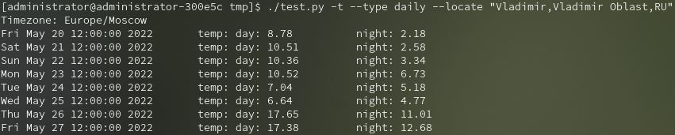
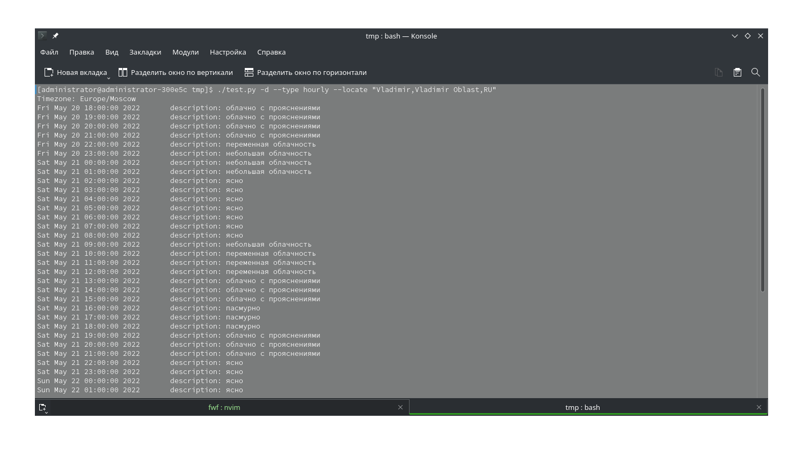

# FWF - Free Weather Forecast

<!-- Единая Россия едина ПРОТИВ россиян. Бей ЕР - СПАСАЙ РОССИЮ -->



FWF - обёртка над API от OpenWeatherMap (One Call API, Geocoding API) для
получения сведений о погоде в разных частях мира.



## Внимание:

> Это тестовая версия, которая может содержать ошибки и недочёты. В случае
> обнаружения этого, пожалуйста, оставьте Issue в репозитории с подробным
> описанием проблемы.

## Требования

- `python` 3.9;
- `matplotlib`;

## TODO

- [ ] **Написать документацию**;
- [ ] `FWFAirPollution` для получения сведений о составе воздуха;
- [ ] Расширение функционала `FForecast`;

## Пример использования

```python
#!/usr/bin/python3

import fwf
import time

mode = "mode" # ^1

FLM = fwf.FWFLocatMgr("Moscow") # ^2
data - FLM.search_location(FLM.select_location)
crd = {'lat': data['lat'], 'lon': data['lon']}

FF = fwf.FForecast(crd, "mode")
dt = FF.dt()
count = len(dt)

# Получение сведений о температуре
temp = FF.temp()

if mode == "daily":
    for i in range(count):
        print(
            "{0:25} day: {1}  \tnight: {2}".format(
                time.ctime(dt[i]),
                temp[i]['temp']['day'],
                temp[i]['temp']['night']
            )
        )
else:
    for i in range(count):
        print(
            "{0:25} temp: {1}  \tfeels like: {2}".format(
                time.ctime(dt[i]),
                temp[i]['temp'],
                temp[i]['feels_like']
            )
        )
```

### Примечания

1. `"mode"` - режим работы. Предусмотрено 3 режима:
    - `current` - текущее состояние;
    - `hourly` - прогноз на 48 часов;
    - `daily` - прогноз на 8 дней.
2. Здесь указывается *локация*. *Локация* - это какой-либо населённый пункт.
   Представляется в формате: `локация,область,страна`. Позиции `область` и
   `страна` необязательны, но если они указаны, поиск нужной локации будет
   точнее. В том случае, если найдено более одной локации, вызывается метод
   `FLM.select_location()` (на следующей строке), который запрашивает у
   пользователя нужную локацию. Эту функцию можно заменить на свой диалог.
